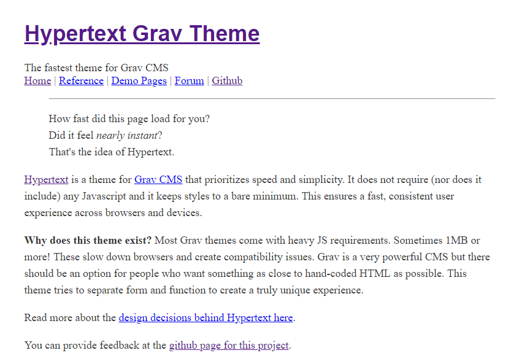

# Hypertext Theme

**Hypertext** is a [Grav](http://github.com/getgrav/grav) theme that focuses on speed and simplicity by using little-to-no JS or CSS.  Hypertext is meant to be used with the latest version of the Grav CMS.

[You can see it live here](http://hypertext.artofthesmart.com).

---

## Screenshot



## Features

* Virtually weightless for maximum performance
* CSS/JS squelches to completely cut out any unnecessary stuff
* Fully responsive across almost any device
* Multiple page template types
* Includes `headless` parameter for serving only content

### Supported Page Templates

* Default view template `default.md`
* Error view template `error.md`
* Blog view template `collection.md`
* Blog item view template `item.md`

# Installation

Installing the Hypertext theme can be done in one of two ways. Our GPM (Grav Package Manager) installation method enables you to quickly and easily install the theme with a simple terminal command, while the manual method enables you to do so via a zip file. 

## GPM Installation (Preferred)

The simplest way to install this theme is via the [Grav Package Manager (GPM)](http://learn.getgrav.org/advanced/grav-gpm) through your system's Terminal (also called the command line).  From the root of your Grav install type:

    bin/gpm install hypertext

This will install the Hypertext theme into your `/user/themes` directory within Grav. Its files can be found under `/your/site/grav/user/themes/hypertext`.

## Manual Installation

To install this theme, just download the zip version of this repository and unzip it under `/your/site/grav/user/themes`. Then, rename the folder to `hypertext`. You can find these files either on [GitHub](https://github.com/artofthesmart/hypertext) or via [GetGrav.org](http://getgrav.org/downloads/themes).

You should now have all the theme files under

    /your/site/grav/user/themes/hypertext

## Options & Setup

Hypertext comes with many options, but most of them are disabled by default to prioritize the fastest possible loading.

### Structural Options

```yaml
allowCSS: 0                   # Prevent any _implicit_ CSS files from being included (e.g. plugins).
allowJS: 0                    # Prevent any _implicit_ JS files from being included (e.g. plugins).
```

This is where you can change core, structural information about the theme.


```yaml
allowCSS: 0                   # Cut out slots for CSS to prevent any _implicit_ CSS from being included (e.g. plugins).
allowJS: 0                    # Cut out slots for JS to prevent any _implicit_ JS from being included (e.g. plugins).
tagline:                      # An optinal tagline to appear under the title of your website
colors:
  background:                 # An optional background color
  text:                       # An optional text color
  link:                       # An optional link color
  activeLink:                 # An optional hover color
  visitedLink:                # An optional visited color
layout:
  configuration: 'centered'   # Whether to pull content to the left or center it
  width: 768                  # The max-width of the theme
style:
  inlineNavbar: 1             # When enabled uses in-line navigation (rather than a list).
  useFavicon: 0               # When enabled, provides the user with a favicon if one is available.
  beautifyText: 0             # When enabled, provides a little CSS for better text spacing.
```

To make modifications, you can copy the `user/themes/hypertext/hypertext.yaml` file to `user/config/themes/` folder and modify, or you can use the admin plugin.

> NOTE: Do not modify the `user/themes/hypertext/hypertext.yaml` file directly or your changes will be lost with any updates

## Override Options
Individual pages have toggles to give you the opportunity to turn on and off global CSS and JS.  Useful for preventing plugins from loading except where you want them.

> Recommend making all your images the same size...

> You can add images to the assets folder if you want.

> Image width is capped at 100% of viewport width, even for zero style themes.  The W3C could never have known about the rise of mobile devices and limited horizontal space. 

> Against my better judgement, I'm going to leave tabular view in place. You can easily shoot yourself in the foot, so don't turn on all the columns.

